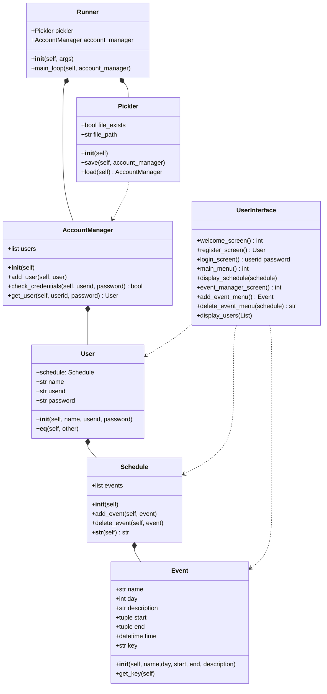

UML Class Diagram

```mermaid
classDiagram
    AccountManager *-- User
    User *-- Schedule
    Schedule *-- Event
    Runner *-- AccountManager
    Runner *-- Pickler
    Pickler ..> AccountManager
    UserInterface ..> Schedule
    UserInterface ..> User
    UserInterface ..> Event

    class Pickler{
        +bool file_exists
        +str file_path
        +__init__(self)
        +save(self, account_manager)
        +load(self) AccountManager
    }

    class AccountManager{
        +list users
        +__init__(self)
        +add_user(self, user)
        +check_credentials(self, userid, password) bool
        +get_user(self, userid, password) User
    }

    class User{
        +schedule: Schedule
        +str name
        +str userid
        +str password
        +__init__(self, name, userid, password)
        +__eq__(self, other)
    }

    class Schedule{
        +list events
        +__init__(self)
        +add_event(self, event)
        +delete_event(self, event)
        +__str__(self) str
    }

    class Event{
        +str name
        +int day
        +str description
        +tuple<int, int> start
        +tuple<int, int> end
        +datetime time
        +str key
        +__init__(self, name,day, start, end, description)
        +get_key(self)

    }

    class UserInterface{

        +welcome_screen() int
        +register_screen() User
        +login_screen() userid password
        +main_menu() int
        +display_schedule(schedule)
        +event_manager_screen() int
        +add_event_menu() Event
        +delete_event_menu(schedule) str
        +display_users(List<User>)
    }

    class Runner{
        +Pickler pickler
        +AccountManager account_manager
        +__init__(self, args)
        +main_loop(self, account_manager)

    }

    
```

First Draft by Shams A.
Created using: 
https://mermaid-js.github.io/mermaid/#/classDiagram
