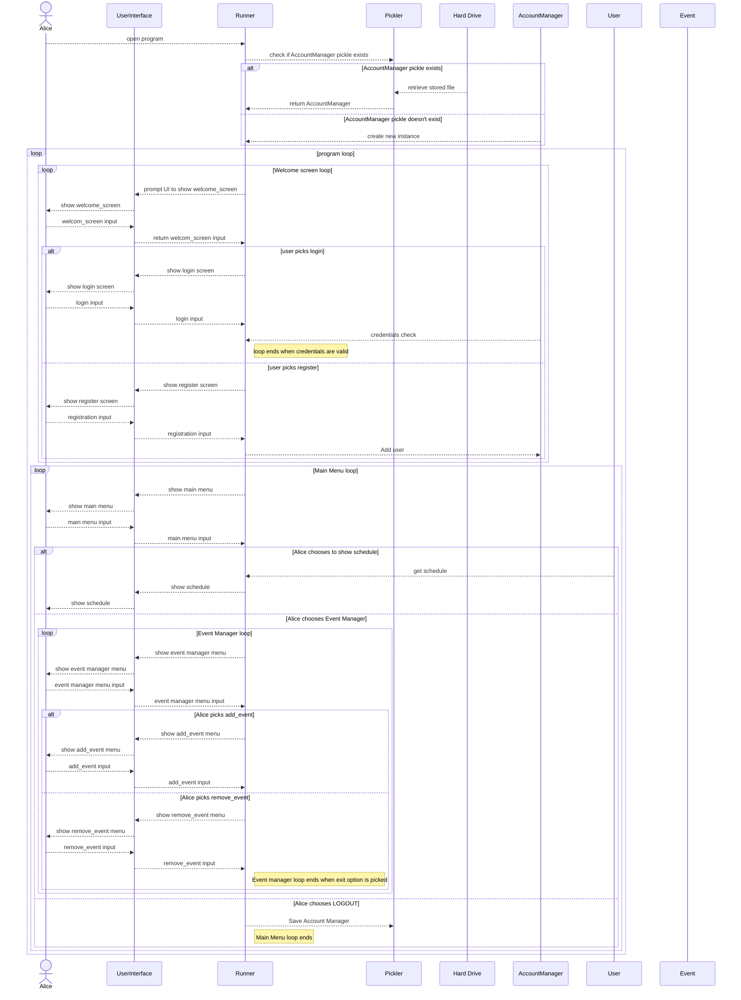

```mermaid
sequenceDiagram

    actor Alice
    Participant UserInterface
    participant Runner
    participant Pickler
    participant Hard Drive
    participant AccountManager
    participant User
    participant Event

    Alice-->>Runner: open program
    Runner-->>Pickler: check if AccountManager pickle exists
    alt AccountManager pickle exists
        Hard Drive -->> Pickler: retrieve stored file
        Pickler-->>Runner: return AccountManager
    else AccountManager pickle doesn't exist
        AccountManager-->>Runner: create new instance
    end
    loop program loop
        loop Welcome screen loop

            Runner-->>UserInterface: prompt UI to show welcome_screen
            UserInterface-->>Alice: show welcome_screen
            Alice-->>UserInterface: welcom_screen input
            UserInterface-->>Runner: return welcom_screen input
            alt user picks login
                Runner-->>UserInterface: show login screen
                UserInterface-->>Alice: show login screen
                Alice-->>UserInterface: login input
                UserInterface-->>Runner: login input
                AccountManager-->>Runner: credentials check
                Note right of Runner: loop ends when credentials are valid
            else user picks register
                Runner-->>UserInterface: show register screen
                UserInterface-->>Alice: show register screen
                Alice-->>UserInterface: registration input
                UserInterface-->>Runner: registration input
                Runner-->>AccountManager: Add user
            end
        end

        loop Main Menu loop

            Runner-->>UserInterface: show main menu
            UserInterface-->>Alice: show main menu
            Alice-->>UserInterface: main menu input
            UserInterface-->>Runner: main menu input
            alt Alice chooses to show schedule
                User-->>Runner: get schedule
                Runner-->>UserInterface: show schedule
                UserInterface-->>Alice: show schedule
            else Alice chooses Event Manager
                loop Event Manager loop
                    Runner-->>UserInterface: show event manager menu
                    UserInterface-->>Alice: show event manager menu

                    Alice-->>UserInterface: event manager menu input
                    UserInterface-->>Runner: event manager menu input
                    alt Alice picks add_event
                        Runner-->>UserInterface: show add_event menu
                        UserInterface-->>Alice:show add_event menu

                        Alice-->>UserInterface: add_event input
                        UserInterface-->>Runner: add_event input
                    else Alice picks remove_event
                         Runner-->>UserInterface: show remove_event menu
                        UserInterface-->>Alice:show remove_event menu

                        Alice-->>UserInterface: remove_event input
                        UserInterface-->>Runner: remove_event input
                        Note right of Runner: Event manager loop ends when exit option is picked
                    end
                end
            else Alice chooses LOGOUT
                Runner-->>Pickler: Save Account Manager
                Note Right of Runner: Main Menu loop ends
            end
            
        end
            
    end
```
Sequence Diagram Draft by Shams A. Created with mermaid UML
