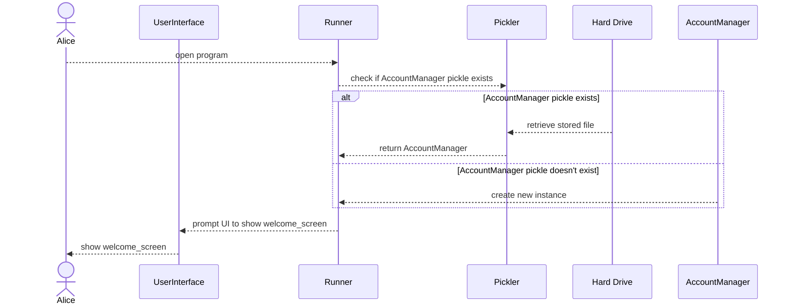

```mermaid
sequenceDiagram

    actor Alice
    Participant UserInterface
    participant Runner
    participant Pickler
    participant Hard Drive
    participant AccountManager

    Alice-->>Runner: open program
    Runner-->>Pickler: check if AccountManager pickle exists
    alt AccountManager pickle exists
        Hard Drive -->> Pickler: retrieve stored file
        Pickler-->>Runner: return AccountManager
    else AccountManager pickle doesn't exist
        AccountManager-->>Runner: create new instance
    end
    Runner-->>UserInterface: prompt UI to show welcome_screen
    UserInterface-->>Alice: show welcome_screen


```